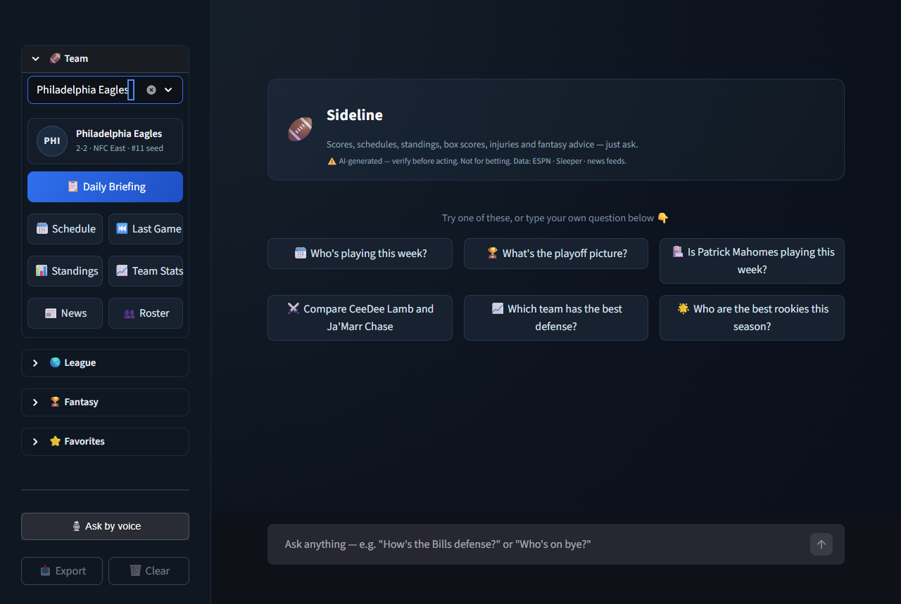
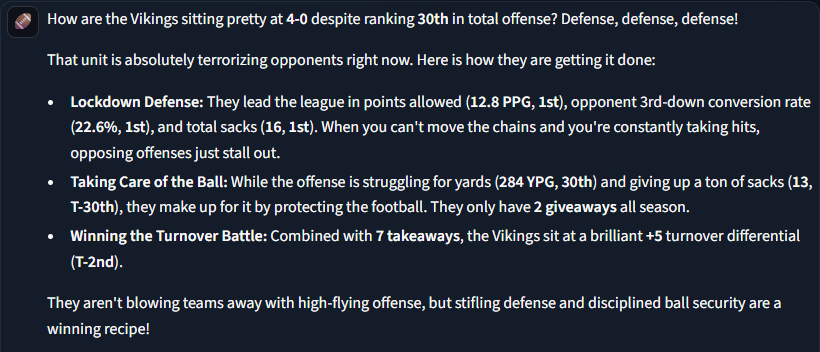
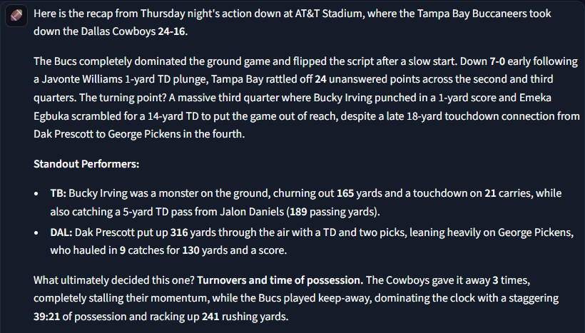
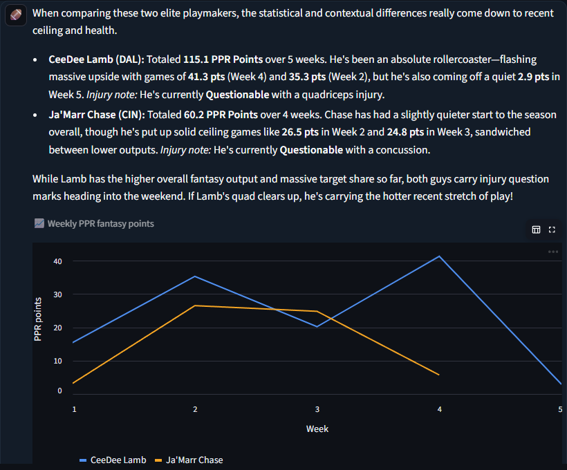
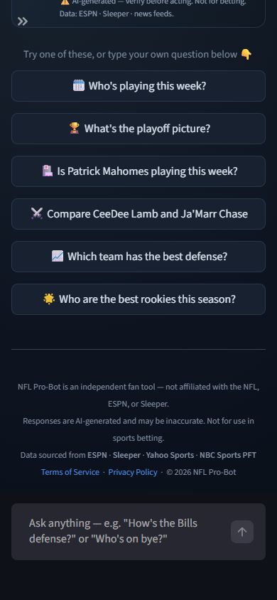
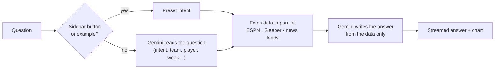

# 🏈 NFL Pro-Bot

[](https://nflchatbot.streamlit.app/)
[](https://github.com/PTucc327/NFL_Chatbot/actions/workflows/ci.yml)


**Author**: Paul Tuccinardi ·
[LinkedIn](https://www.linkedin.com/in/paul-tuccinardi/) ·
[GitHub](https://github.com/PTucc327)

> An NFL assistant that answers in plain English from **live data**: scores,
> schedules, standings, box scores, injuries, team rankings and fantasy advice.

### **[Try it live → nflchatbot.streamlit.app](https://nflchatbot.streamlit.app/)**



---

## Why it's different

General-purpose chatbots answer sports questions from training data that is
months out of date. NFL Pro-Bot fetches the current data first (ESPN, Sleeper,
news feeds) and only then has an LLM write the answer, under the rule that
current-season facts come **only** from that data. The result reads like an
analyst and is grounded in this week's numbers.

<table>
<tr>
<td width="50%"><b>"Why are the Vikings 4-0?"</b><br>Answered from computed league ranks for all 32 teams.<br><br></td>
<td width="50%"><b>"Box score from last night's game?"</b><br>A recap built from the line score, team stats and scoring plays.<br><br></td>
</tr>
<tr>
<td><b>"Compare CeeDee Lamb and Ja'Marr Chase"</b><br>Weekly fantasy points, injuries and a chart that stays in the chat.<br><br></td>
<td><b>Works on phones</b><br>One-tap example questions; tools in the sidebar.<br><br></td>
</tr>
</table>

---

## What you can ask

| Topic | Examples | Data |
|---|---|---|
| **Game day** | "Who's playing Thursday night?" · "Who's on bye?" · "What's happening in the Cowboys game?" (possession, down & distance, last play) | ESPN scoreboard |
| **Box scores** | "How did the Giants beat the Cardinals?" · "Chiefs Week 3 box score" | ESPN game summaries |
| **Schedules** | "When do the Cowboys play the Eagles?" · "Chiefs' remaining schedule" | ESPN team schedules |
| **Standings & playoffs** | "NFC East standings" · "AFC playoff picture" · "Would the Eagles make it if the season ended today?" | ESPN standings (official seeds) |
| **Team rankings** | "How's the Bills defense?" · "Best run defense in the league?" | ESPN team stats, ranked across all 32 teams |
| **Players & injuries** | "Is Mahomes playing this week?" · "Tell me about Travis Hunter" · "Who's the Ravens' backup QB?" | Sleeper players, weekly rosters |
| **Fantasy** | "Start Bijan or Gibbs?" · "Trade Kelce for Lamb?" · "Best WR waiver pickups" · "Top 5 fantasy QBs" · "Best rookies" | Sleeper stats and trending adds |
| **History & rules** | "Who won the Super Bowl last season?" · "2024 playoff results" · "How does playoff overtime work?" | ESPN postseason results; the model's general knowledge for rules |

Also included: one-tap team briefings, a favorite-team profile, voice input,
chat export, betting lines, team news, and 109 legend profiles.

---

## How it works



1. **Understand.** Gemini turns the question into structured intents
   (`box_score`, `playoffs`, `team_stats`…) plus team, player, opponent, week and
   season, given today's date so "this season" resolves correctly. Sidebar
   buttons and example questions skip this step.
2. **Fetch.** All intents run in parallel with a 20s ceiling. Name matching
   ranks exact matches first, then Sleeper's popularity rank, and asks *"which
   one?"* when two active players share a name.
3. **Answer.** Gemini writes the reply from the fetched data and streams it in.
   If the model fails after the data arrives, the raw data is shown instead.

---

## Engineering highlights

**Runs on the free Gemini tier**
- Model chains (`gemini-3.5-flash-lite` → `2.5-flash` → `3.5-flash` → `3.1-flash-lite`)
  fall through on quota limits, retired models, server errors or a 20s
  deadline. Each model has its own quota, so daily capacity adds up.
- Per-model cooldowns: a spent daily quota pauses that model until midnight
  Pacific, and a per-minute limit uses Google's retry hint.
- Model "thinking" is off, because the answers restate fetched data
  (first token in 0.6s instead of 4.1s). A model that rejects the setting is
  retried without it and remembered.
- Presets skip a model call, and identical sidebar answers are cached for
  5 minutes and shared across visitors.

**Data layer**
- League stats are trimmed and cached: finished weeks for 24h, the live week
  for 15 min. A repeat player question went from 2.6s to 0.1s.
- Team rankings are computed across all 32 teams (rank 1 = best). ESPN's own
  ranks are partial and don't state which direction is better.
- Caches warm in the background at startup, so a cold start (Streamlit Cloud
  sleeps idle apps) doesn't slow the first question.

**Safety & privacy**
- App-wide and per-session rate limits.
- Output filter for stray non-Latin script from the lite model.
- HTML escaping on everything user-supplied.
- No accounts. Chat lives in the browser tab, and timestamps use the viewer's
  own timezone.
- Secrets never leave environment variables.

**Testing & CI** (every push)

| Job | What it checks |
|---|---|
| Unit tests | 267 tests; all HTTP and Gemini calls mocked |
| Browser tests | 13 Playwright tests drive the real app (first visit, questions, player selection, sidebar tools, timezones, phone layout). Gemini is replaced by a stand-in, so no key or quota is used |
| Secrets scan | `detect-secrets` blocks any credential not in the baseline |
| Dependency audit | `pip-audit --strict` on production and dev requirements |

Each browser test guards a bug that was found by hand. The suite was checked
by reintroducing those bugs and confirming the tests fail.

---

## Tech stack

| Layer | Technology |
|---|---|
| UI | Streamlit 1.54 (Community Cloud) |
| LLM | Google Gemini via `google-genai` 2.7: 3.5 Flash-Lite, 2.5 Flash, 3.5 Flash |
| Data | ESPN site API · Sleeper API · RSS (Google News, Yahoo Sports, ProFootballTalk) |
| Matching | `rapidfuzz` |
| Charts | Streamlit charts (pandas) |
| Voice | `streamlit-mic-recorder` |
| Testing | `pytest` 9 · Playwright 1.58 |
| CI / automation | GitHub Actions (CI + weekly roster refresh) |

---

## Run it locally

Get a **free** Gemini API key at [aistudio.google.com/app/apikey](https://aistudio.google.com/app/apikey).

**macOS / Linux**
```bash
git clone https://github.com/PTucc327/NFL_Chatbot.git
cd NFL_Chatbot
pip install -r requirements.txt
cp template.env .env          # then set GEMINI_API_KEY in .env
streamlit run app.py
```

**Windows (PowerShell)**
```powershell
git clone https://github.com/PTucc327/NFL_Chatbot.git
cd NFL_Chatbot
pip install -r requirements.txt
Copy-Item template.env .env   # then set GEMINI_API_KEY in .env
streamlit run app.py
```

`template.env` documents the optional settings: model chains, rate caps, the
Gemini deadline, and local favorites.

---

## Running tests

```bash
pip install -r requirements-dev.txt
python -m pytest tests/ -q                     # unit tests (no network, no key)
python -m playwright install chromium          # once, for browser tests
```

Browser tests start the app themselves. They run only when `RUN_E2E=1` is set:

```bash
RUN_E2E=1 python -m pytest tests/e2e -v                       # macOS / Linux
```
```powershell
$env:RUN_E2E = "1"; python -m pytest tests/e2e -v             # Windows PowerShell
```

**Answer-quality evals** run 27 real fan questions through the real pipeline
(Gemini and live data) and check each answer against the data it was given:
numbers grounded in the data, the right team/player understood, the Super Bowl
winner named, and so on. Run them before and after changing prompts or models;
see [evals/README.md](evals/README.md).

```bash
python -m evals.run            # ~55 free-tier Gemini requests, ~2 minutes
```

To use an installed browser instead of Playwright's Chromium, set
`PW_CHANNEL=msedge` (or `chrome`). The app runs with `NFL_BOT_FAKE_LLM=1` in
these tests: Gemini is swapped for stand-ins that echo the fetched data.

---

## Deploying to Streamlit Community Cloud

1. Push the repo to GitHub (`.env` and `.streamlit/secrets.toml` are gitignored).
2. Go to [share.streamlit.io](https://share.streamlit.io) → **Create app** → **Deploy a public app from GitHub**.
3. Repository `PTucc327/NFL_Chatbot`, branch `main`, main file path `app.py`.
4. Open **Advanced settings**:
   - **Python version:** `3.12` (matches CI).
   - **Secrets:**
     ```toml
     GEMINI_API_KEY = "your_key_here"
     REPO_URL = "https://github.com/PTucc327/NFL_Chatbot"
     ```
     Root-level secrets are exposed to the app as environment variables.
5. **Deploy.** Every push to `main` redeploys automatically.

Operations notes:
- **Logs** are under *Manage app* on share.streamlit.io. Quota warnings include
  the limit values.
- **Free-tier limits** are per model and per Google Cloud project, and reset at
  midnight Pacific. Check yours at
  [aistudio.google.com/rate-limit](https://aistudio.google.com/rate-limit).
- **Never enable `ENABLE_LOCAL_PREFS`** on a hosted app: all visitors would
  share one favorites file.

---

## Automated data refresh

A scheduled GitHub Actions workflow (`refresh_data.yml`) runs every Tuesday at
10:00 UTC, and can also be run from the Actions tab. It:
- rebuilds `data/rosters.json`, the depth charts behind "who's the backup QB?";
- commits the file back to `main`, which redeploys the app.

`scripts/update_data.py --prospects` removes draft prospects once they've
reached the NFL.

---

## Project structure

```
NFL_Chatbot/
├── app.py                    # Streamlit UI: consent, sidebar tools, chat, charts
├── src/
│   ├── api_client.py         # Data layer: ESPN/Sleeper/RSS, caches, rankings, box scores
│   ├── chatbot.py            # Gemini pipeline: model chains, intents, dispatch, answers
│   └── utils.py              # Fuzzy matching, HTTP with backoff, time helpers
├── data/                     # teams, legends (109), prospects, weekly rosters
├── scripts/update_data.py    # Roster refresh and prospect pruning
├── tests/
│   ├── test_*.py             # Unit tests (267)
│   └── e2e/                  # Playwright browser tests (13)
├── evals/                    # Answer-quality evals: 27 real questions + checks
├── docs/screenshots/         # README images, captured from the live app
├── .github/workflows/        # ci.yml (4 jobs) · refresh_data.yml (weekly)
├── .streamlit/config.toml    # Dark theme, headless server
├── requirements.txt          # Production dependencies (what the cloud installs)
├── requirements-dev.txt      # + pytest, Playwright
└── template.env              # Every setting, documented
```

---

## Limitations

- **Free-tier capacity.** Daily usage is bounded by Gemini's free quotas. When
  every model's quota is spent, the app says so and suggests coming back after
  midnight Pacific.
- **Unofficial data sources.** ESPN's site API is undocumented and can change
  without notice.
- **Cold starts.** Community Cloud sleeps idle apps; the first visitor after a
  sleep waits about a minute for it to wake.
- **Not for betting.** Answers are AI-written and can be wrong.

---

## Legal & privacy

- No accounts, and nothing is stored server-side. Chat history lives only in
  your browser tab.
- Questions are processed by Google Gemini. On the free tier, Google may use
  them to improve its products, so please don't include personal information.
- Responses are AI-generated and may be inaccurate. **Not for use in sports betting.**
- Data comes from ESPN, Sleeper and public RSS feeds. Team names and marks belong
  to the NFL and its teams. This is an independent fan project, not affiliated
  with the NFL, ESPN or Sleeper.
- See [PRIVACY_POLICY.md](PRIVACY_POLICY.md) and [TERMS_OF_SERVICE.md](TERMS_OF_SERVICE.md).

---

## Roadmap

- [x] Live scores with in-game situation, schedules, bye weeks
- [x] Box scores and game recaps
- [x] Division standings and playoff picture (official seeds)
- [x] Team offense/defense rankings
- [x] League, position and rookie leaders
- [x] Fantasy: sit/start, comparisons, trades, trending waiver adds
- [x] Past playoffs and Super Bowls
- [x] Free-tier model chains, browser tests in CI, public deployment
- [x] Answer-quality evals (27 cases), run before prompt or model changes
- [ ] Connect a Sleeper league (real waiver availability, your roster)
- [ ] Injury alerts for a favorite team
